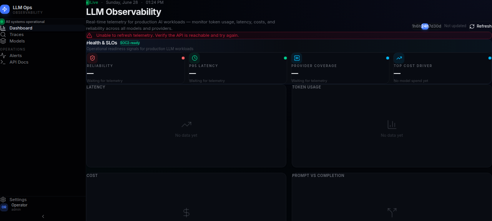
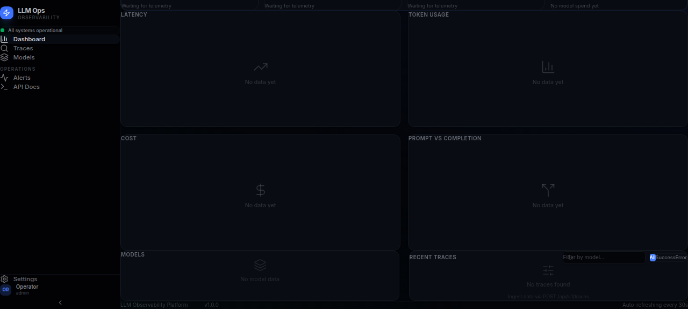

# LLM Observability Dashboard

A clean, mature, self-hosted observability dashboard for monitoring LLM (Large Language Model) workloads. Track token usage, latency, cost, and errors across all your AI API calls — with a beautiful dark-themed dashboard.


## What It Does

- **Ingest traces** via REST API — log every LLM call with token counts, latency, cost, and model info
- **Real-time dashboard** with stat cards, area charts, and a trace table
- **Time-series aggregation** — latency, token usage, and cost over time
- **Per-model breakdown** — compare performance across different models and providers
- **Error tracking** — error rate monitoring and failed request visibility

## Complete Architecture

```
┌─────────────────┐     REST API      ┌──────────────────┐
│  Your AI App    │ ──── POST ────────▶│  Go Backend      │
│  (instrumented) │    /api/v1/traces  │  :8090           │
└─────────────────┘                     │  SQLite DB      │
                                        └────────┬─────────┘
                                                 │
┌─────────────────┐                              │
│  Dashboard UI   │ ◀──── GET /api/v1/stats ────┘
│  React + Vite   │
│  :5173          │
└─────────────────┘
```

## Quick Start

### Backend

```bash
cd backend
GONOSUMCHECK='*' GONOSUMDB='*' GOPROXY='https://proxy.golang.org,direct' go mod tidy
PORT=8090 go run ./cmd/server
# API running on :8090
```

### Frontend

```bash
cd frontend
npm install
npm run dev
# Dashboard at http://localhost:5173
```

### Ingest Sample Data

```bash
curl -X POST http://localhost:8090/api/v1/traces \
  -H 'Content-Type: application/json' \
  -d '[{
    "model": "gpt-4o",
    "provider": "openai",
    "prompt_tokens": 1245,
    "completion_tokens": 89,
    "latency_ms": 1234,
    "time_to_first_token_ms": 210,
    "cost": 0.0042,
    "status": "success"
  }]'
```

## API Endpoints

| Method | Endpoint | Description |
|--------|----------|-------------|
| `POST` | `/api/v1/traces` | Ingest trace(s) — accepts array |
| `GET` | `/api/v1/traces` | List traces (paginated, filterable) |
| `GET` | `/api/v1/traces/:id` | Get single trace detail |
| `GET` | `/api/v1/stats/overview` | Aggregate stats for dashboard cards |
| `GET` | `/api/v1/stats/timeseries` | Time-series buckets for charts |
| `GET` | `/api/v1/stats/models` | Per-model breakdown |
| `GET` | `/api/v1/health` | Health check |

Query params: `since=24h`, `since=7d`, `interval=1h`, `page=1`, `limit=50`, `model=gpt-4o`, `status=success`

## Dashboard

- **Stat cards**: Total requests, tokens, avg latency, cost, error rate, prompt/completion split, active models, throughput — with loading skeletons and dynamic accent coloring by threshold
- **Health & SLOs**: Reliability posture, P95 latency, provider coverage, top cost driver — tone-coded status rings
- **Area charts**: Latency, token usage, cost, and prompt vs completion stacked area — consistent oklch palette
- **Traces table**: Model search, status filter chips (All/Success/Error), skeleton loading, responsive columns, status dot indicators, pagination
- **Model breakdown**: Sortable columns, cost mini-bar visualization, status-colored error rates
- **Sidebar**: Branded header, live health pulse, navigation sections, user area, collapsible
- **Enterprise dark theme**: Deep midnight-slate palette, Inter + JetBrains Mono fonts, shimmer animations

## Screenshots

### Dashboard Overview



*Stat cards, latency/cost/token charts, with the Observability sidebar — all live data from the Go + SQLite backend.*

### Model Breakdown & Traces



*Per-model breakdown table comparing gpt-4o, claude-sonnet-4, gpt-4o-mini, claude-haiku, llama-3-70b across requests, tokens, latency, cost, and error rate. Recent traces table with status badges and pagination.*

## Tech Stack

| Layer | Technology |
|-------|------------|
| Backend | Go 1.25+ (net/http, gorilla/mux) |
| Database | SQLite (modernc.org/sqlite — pure Go) |
| Frontend | React 18, TypeScript, Vite |
| Charts | Recharts |
| Styling | Tailwind CSS 4, custom dark theme |
| Icons | Lucide React |

## License

MIT
